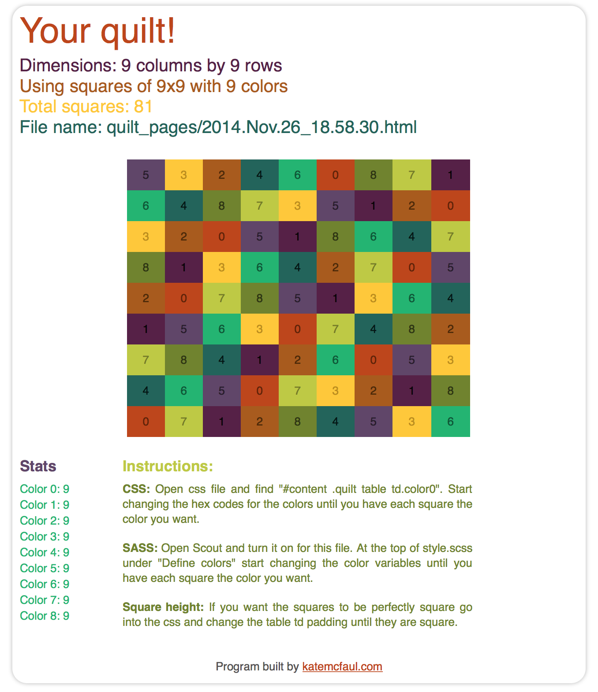

# Quilt Program

## Overview

This is a program I built while putting together a quilt of crochet granny squares. I input a few variables into the program (how many rows and columns I want, how many colors I have etc) and the program will put together the squares so that no color is touching another square of the same color either on the sides or the corners. Say I'm using 9 colors and want blocks of size 8x8 where no color is repeated in the same column or row, and doesn't touch another block of the same color. It will then put together as many 8x8 blocks (or fraction thereof) as needed until the quilt is the right size. 

## Why I built this program

It's hard to come up with unique blocks! By the end of each block it's often impossible to come up with an 8th row. It was taking me way too much time to just come up with a small square of unique blocks, let alone a large quilt just the way I wanted it. So I decided to let my computer do the heavy lifting for me. 

## Instructions

1. **Download program** to folder of your choice
2. Open `build_quilt.rb` and **change the following variables**:
    * **@needed_rows**: Input how many rows _long_ the quilt should be
    * **@needed_columns**: Input how many columns _wide_ the quilt should be. At this time the program can handle up to **two** blocks wide. So if your unique square size is 8x8 you can have up to 16 columns. It's an easy fix to make it wider, I just didn't need to do that.
    * **colors**: Input how many different colors you are using
    * **@square_size**: Input how big each unique square should be. (For example "8" would be 8 rows by 8 columns where each color is in each row and column only once. I like to have one more color than the square size, so 9 colors and blocks of 8x8. This really adds to the randomness of the quilt.) _Note: this can NOT be bigger than the amount of colors you have! It would be impossible to have a row of 9 when you are only using 6 colors!_
3. Navigate to `quilt_program` folder in terminal and **run `ruby build_quilt.rb`**
    * Program will build the quilt with the specified variables and spit out in the terminal window the final combination, along with the amount of squares used for each color.
    * The program is very fast, but depending on your variables (maybe you're building squares of 8x8 and using 8 colors and you have 16 rows by 24 columns) this might take up to 30 seconds or so, so the program will tell you as it goes which row it is on so you're not watching a blank screen wondering if it's working. First it goes down the left side, then the right side, outputting which row it is building. Fun to watch! Or maybe I'm just a nerd. 
    * The program will then build an html page with a visual representation of your quilt! That way you can see how each color looks laid out in your quilt. I really wanted this feature since I had both light green and dark green and light purple and dark purple. I wanted to make sure that the combination the program came up with didn't have too many like colors next to each other. Also,  This will help you decide which color to assign to each number. Say color 3 has the most squares and color 6 has the fewest. Maybe you want more orange and less blue - simply assign orange to color 3 and blue to color 6!
4. **Adjust squares** if necessary. 
    * There are instructions on the html page, but to **swap colors or change them out for other colors** open the css (or scss if you have sass capabilities) and either change the hex codes in the css for the table td cell colors or change the variables in the color section of the scss.
    * Depending on how many rows you have your squares might not come out perfectly square. If this matters to you, find the part in the css (or scss) for the padding top and bottom on the table td cells and adjust those as needed.

## Example

Here is what the final html page looks like after you have run the program. So pretty! And makes it easy to see if you will like the combination of colors. 

Hover over a square in the quilt to see just that color to make sure you like the distribution of each color!

